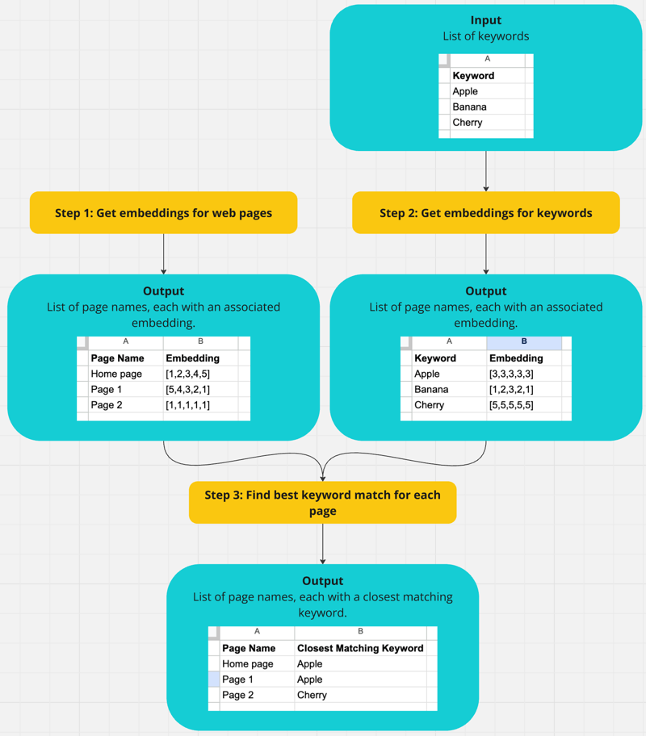

# Intro
This project experiments with some of the techniques and scripts from https://ipullrank.com/vector-embeddings-is-all-you-need.

# Aim
For a given website and a list of keywords, this project will return a list of pages on the website and the keyword that most closely matches each page.

There is scope for returning more info in future, e.g. for each keyword, producing a ranking of how well each page matches.

# Approach
